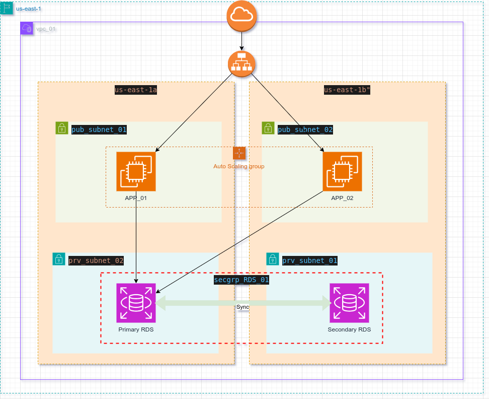

# Provision a highly available application

## Overview
> In this project will deploy a highly available appcalition and database. the main aim of this project is to build a successfull communication between The Application and The Database; the infrastructure componenets consists of the following:
- Provision a Multi-az RDS PostgreSQL database.
- Provision an autoscaling group and load balancer for two EC2 machines.
- Build a simple Python Flask application that build a connection with The RDS.
  
The Infrastructure provisioning will be automated whereby AWS Pipeline besides IaC Terraform, for more info view the Deploy_a_highly_available_Sprint_application.pdf document.  

## Architecture Diagram

  

## Directory structure discovery

├── buildspec.yml  >> AWS pipeline configuration file. 
├── infra          >> Terrafrom resources directory 
│   ├── asg.tf                >> Auto-scaling group resources 
│   ├── configureProvider.tf  >> terrafrom provider configurations 
│   ├── igw.tf             >> internet gateway resources 
│   ├── lb.tf              >> load balancer resources 
│   ├── locals.tf          >> local variables 
│   ├── rds.tf             >> RDS resources 
│   ├── rt.tf              >> Route table resources 
│   ├── sg.tf              >> Security group resources 
│   ├── subnet.tf          >> Subnet resources 
│   ├── terraform.tfvars   >> Variable values file 
│   ├── variables.tf       >> Variable definition file 
│   └── vpc.tf             >> VPC resources 
├── README.md 
└── srcApp                 >> Python Flask source code 
    ├── app.py             >> Python application file 
    └── prerequisites.sh   >> Prerequisites should be installed first 

