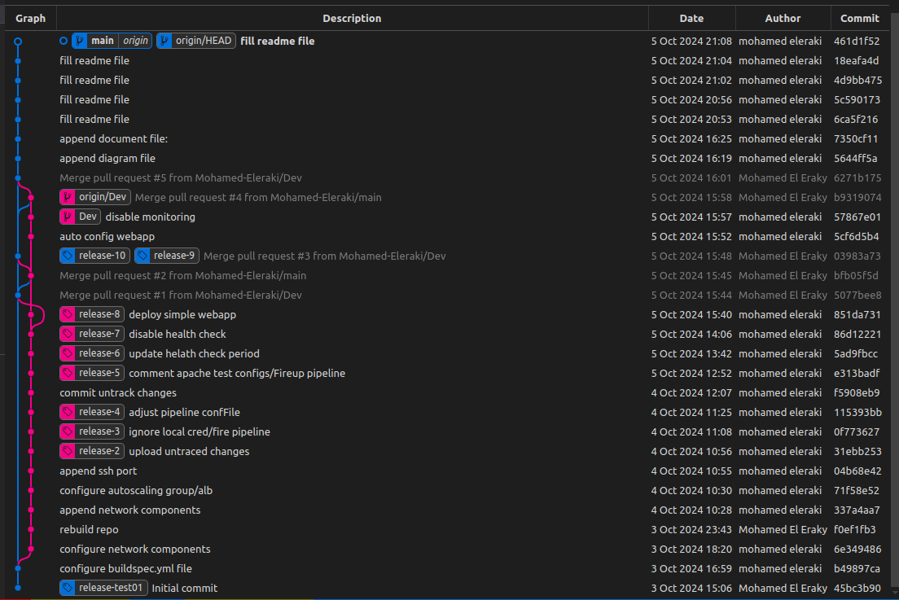

# Provision a highly available application

## Overview
In this project will deploy a highly available appcalition and database. the main aim of this project is to build a successfull communication between The Application and The Database; the infrastructure componenets consists of the following:
- Provision a Multi-az RDS PostgreSQL database.
- Provision an autoscaling group and load balancer for two EC2 machines.
- Build a simple Python Flask application that build a connection with The RDS.
<br> 

> The Infrastructure provisioning will be automated whereby AWS Pipeline besides IaC Terraform, for more info view the **Deploy_a_highly_available_Sprint_application.pdf** document.<br><br>

## Architecture Diagram
Below is the architecture diagram of the project:


<br><br>


## Directory structure discovery
Below are the project directoy structure<br>

```bash
├── buildspec.yml  >> AWS pipeline configuration file.<br>
├── infra          >> Terrafrom resources directory<br>
│   ├── asg.tf                >> Auto-scaling group resources<br>
│   ├── configureProvider.tf  >> terrafrom provider configurations<br>
│   ├── igw.tf             >> internet gateway resources<br>
│   ├── lb.tf              >> load balancer resources<br>
│   ├── locals.tf          >> local variables<br>
│   ├── rds.tf             >> RDS resources<br>
│   ├── rt.tf              >> Route table resources<br>
│   ├── sg.tf              >> Security group resources<br>
│   ├── subnet.tf          >> Subnet resources<br>
│   ├── terraform.tfvars   >> Variable values file<br>
│   ├── variables.tf       >> Variable definition file<br>
│   └── vpc.tf             >> VPC resources<br>
├── README.md<br>
└── srcApp                 >> Python Flask source code<br>
    ├── app.py             >> Python application file<br>
    └── prerequisites.sh   >> Prerequisites should be installed first<br>
```
<br><br>


## info
- Update RDS endpoint in the python script.
- update master passswrod in the python script.

<br><br>
## Project Commits
Below are the commits made to the project:

<br><br>
## Python Flask application

> The Python Flask application is a simple web server that accepts HTTP requests and returns a response. The connection to RDS is successfull, let's discover the code toghether below:

```Python
from flask import Flask
import psycopg2

app = Flask(__name__)

def connect_db():
    try:
        conn = psycopg2.connect(
            host=<"rds_endpoint">,
            database=<"database_name>,  
            user=<"username">,      
            password=<"password"> 
        )
        return "Connected to the database!"
    except Exception as e:
        return f"Failed to connect: {str(e)}"

@app.route('/')
def index():
    return connect_db()

if __name__ == "__main__":
    app.run(host='0.0.0.0', port=80)

```
<br><br>
## Run the Flask application manually
First you need to run the following commands:<br>
```bash
sudo yum update -y
sudo yum install python3 -y
sudo yum install python3-pip -y
sudo yum install git -y
sudo pip3 install psycopg2-binary Flask
```
<br><br>

Then, run the application:
```bash
sudo python3 app.py
```